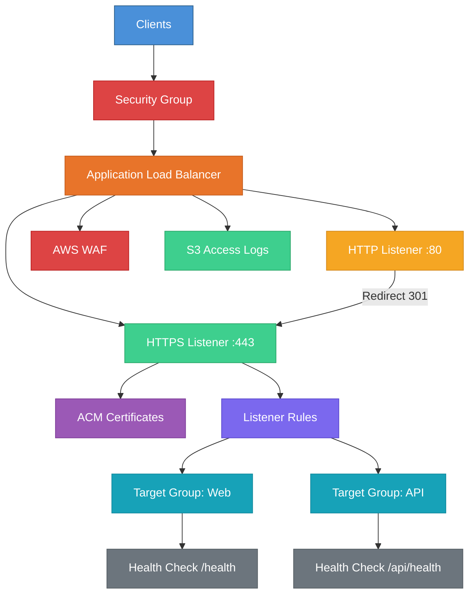

# terraform-aws-alb

A production-ready Terraform module for deploying AWS Application Load Balancers with target groups, listener rules, SSL/TLS termination, WAF integration, and access logging.

## Architecture



## Features

- Application Load Balancer with internet-facing or internal modes
- Multiple target groups with health checks and session stickiness
- HTTP and HTTPS listeners with automatic HTTP-to-HTTPS redirect
- TLS 1.3 support with configurable SSL policies
- Additional SSL certificates via SNI
- Listener rules with host header, path pattern, and HTTP header conditions
- Security group with configurable ingress rules
- S3 bucket for access logs with lifecycle management
- WAF Web ACL integration
- Deletion protection support

## Usage

### Basic

```hcl
module "alb" {
  source = "github.com/kogunlowo123/terraform-aws-alb"

  project_name = "my-app"
  environment  = "dev"
  vpc_id       = "vpc-0123456789abcdef0"
  subnet_ids   = ["subnet-aaa", "subnet-bbb"]

  target_groups = [
    {
      name = "web"
      port = 8080
    }
  ]
}
```

### Complete

See the [examples/complete](examples/complete/main.tf) directory for a full configuration example with HTTPS, multiple target groups, listener rules, and access logging.

## Requirements

| Name      | Version   |
|-----------|-----------|
| terraform | >= 1.5.0  |
| aws       | >= 5.30.0 |

## Inputs

| Name | Description | Type | Default |
|------|-------------|------|---------|
| project_name | Name of the project | string | - |
| environment | Environment name | string | "prod" |
| vpc_id | VPC ID | string | - |
| subnet_ids | Subnet IDs for ALB | list(string) | - |
| internal | Internal or internet-facing | bool | false |
| certificate_arn | ACM certificate ARN | string | null |
| target_groups | Target group configurations | list(object) | [] |
| listener_rules | Listener rule configurations | list(object) | [] |
| enable_access_logs | Enable access logging | bool | false |
| waf_arn | WAF Web ACL ARN | string | null |

## Outputs

| Name | Description |
|------|-------------|
| alb_arn | ALB ARN |
| alb_dns_name | ALB DNS name |
| security_group_id | ALB security group ID |
| target_group_arns | List of target group ARNs |
| https_listener_arn | HTTPS listener ARN |

## License

MIT Licensed. See [LICENSE](LICENSE) for details.
